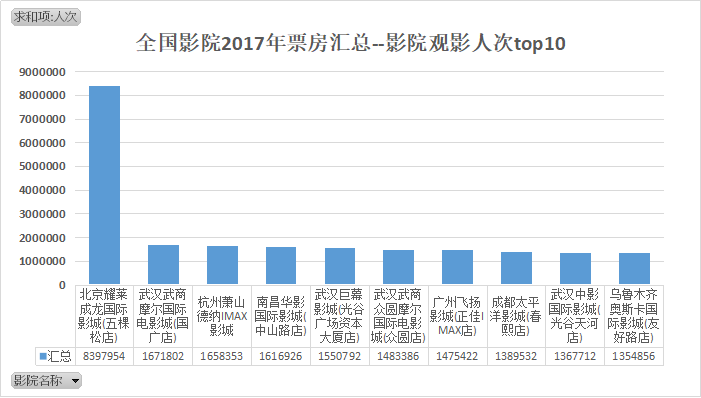
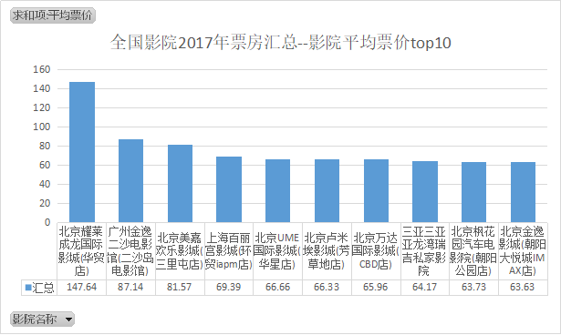
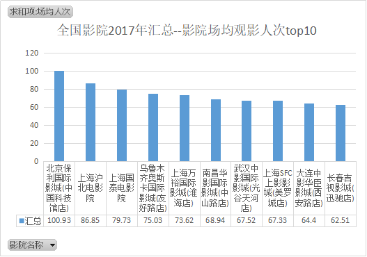

# china-cinemabox-maoyan
### 2017猫眼电影票房

#### 程序运行方法：

- 安装依赖包

```
pip3 install requests
```

- 运行

```
python3 main.py
```

### 项目简述

- 爬取前分析
  - 确定爬取接口（每天票房排名前6439个影院的信息）
- 爬取流程
  - 确定爬取的日期
  - 将日期生成为带爬日期集合
  - 利用多线程爬取每日的票房信息（【影院ID，影院名称，观影人次，场均人次，平均票价】）
  - 将爬取失败的日期记录并丢回带爬日期集合
  - 将多线程设为守护线程
  - 线程爬取结果本地持久化为json文件
  - 集合为空即结束
- 数据清洗及统计
  - 对于每日未进入爬取排名的影院设置属性默认值为0
  - 对于票房/人次以万为单位的进行数值替换
  - 对每日的票房信息进行累加求均值
- 图标展示

1、全国影院2017年票房汇总--观影人次TOP10

<center>  </center>

2、全国影院2017年票房汇总--影院评价票价TOP10

<center></center>

3、全国影院2017年汇总--影院场均观影人次TOP10

<center></center>


